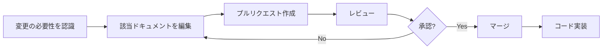

# nuyna ドキュメント

**最終更新:** 2026年1月10日

このディレクトリには、nuynaプロジェクトの全ての設計・開発ドキュメントが格納されています。

---

## 📋 ドキュメント構造

| ディレクトリ | 内容 | 主要ドキュメント |
| :--- | :--- | :--- |
| **00_project_overview/** | プロジェクト概要・ビジョン | （今後追加予定） |
| **01_architecture/** | システムアーキテクチャ設計 | （今後追加予定：C4モデル、システム構成図） |
| **02_requirements/** | 要件定義 | （今後追加予定：機能要件、非機能要件） |
| **03_design/** | 詳細設計 | （今後追加予定：UI/UX設計、API設計） |
| **04_implementation/** | 実装ガイド | （今後追加予定：コーディング規約、プラットフォーム別実装） |
| **[05_quality_assurance/](05_quality_assurance/)** | 品質保証・テスト | QA評価レポート、テストシナリオ |
| **[06_sprints/](06_sprints/)** | スプリント計画と結果 | 開発計画、スプリント分析 |
| **[07_issues_and_fixes/](07_issues_and_fixes/)** | 問題と修正記録 | メタデータ削除問題、UI改善 |
| **08_operations/** | 運用・デプロイ | （今後追加予定：デプロイガイド、監視戦略） |
| **[09_reference/](09_reference/)** | 参考資料 | ベンチマーク、テスト環境分析 |

---

## 🎯 重要ドキュメント（必読）

### 開発を開始する前に

1. **[QA評価レポート](05_quality_assurance/qa_report.md)** - 現在の品質状況と課題を理解する
2. **[総合開発計画](06_sprints/sprint_10_onwards/comprehensive_development_plan.md)** - 今後8週間の開発計画
3. **[コードレビュー結果](05_quality_assurance/code_review_findings.md)** - コードベースの問題点

### 実装時の参照

4. **[メタデータ削除問題](07_issues_and_fixes/metadata_deletion_issue.md)** - P0問題の詳細と修正方法
5. **[UI改善ガイド](07_issues_and_fixes/ui_improvement.md)** - UI/UXの改善実装
6. **[Android テスト戦略](06_sprints/sprint_10_onwards/android_testing_strategy.md)** - Android未テスト対策

---

## 📖 ドキュメント使用ルール

### Single Source of Truth (SSoT)

**このディレクトリ内のドキュメントが、プロジェクトの唯一の正式な情報源です。**

開発者、QA、プロダクトマネージャーは、以下のルールを厳守してください：

1. **絶対遵守:** `/doc` 以下のドキュメントに記載された仕様、設計、計画は、**絶対的な指示**として扱います。
2. **変更時の更新:** コードを変更する際は、対応するドキュメントも同時に更新します。
3. **レビュー必須:** ドキュメントの変更は、コードと同様にプルリクエストでレビューします。
4. **矛盾の解決:** コードとドキュメントが矛盾する場合、**ドキュメントが正**とし、コードを修正します。

### AI開発エージェント（Antigravity等）への指示

**AI開発エージェントは、以下のルールに従ってください：**

1. **ドキュメント優先:** 開発タスクを開始する前に、必ず関連するドキュメントを読み込みます。
2. **仕様の厳守:** ドキュメントに記載された仕様、設計、アーキテクチャを厳密に遵守します。
3. **独自判断の禁止:** ドキュメントに記載がない事項について、独自の判断で実装しません。不明点は必ず確認します。
4. **変更の記録:** 実装中に設計変更が必要になった場合、ドキュメントを更新してからコードを変更します。

---

## 🔄 ドキュメント更新フロー

---

## 📝 ドキュメント作成ガイドライン

新しいドキュメントを作成する際は、以下のガイドラインに従ってください：

1. **Markdown形式:** 全てのドキュメントは `.md` 形式で作成します。
2. **明確なタイトル:** ファイル名と見出しは、内容を明確に表すものにします。
3. **更新日の記載:** ドキュメントの冒頭に、最終更新日を記載します。
4. **図の活用:** Mermaid、PlantUML、C4モデルなどを活用し、視覚的に理解しやすくします。
5. **リンクの活用:** 関連するドキュメントへのリンクを積極的に使用します。

---

## 🚀 次のステップ

1. **[総合開発計画](06_sprints/sprint_10_onwards/comprehensive_development_plan.md)** を読み、全体像を把握する
2. **[QA評価レポート](05_quality_assurance/qa_report.md)** で現状の課題を理解する
3. **Sprint 1** のタスクに着手する

---

**質問や不明点がある場合は、プロジェクトリーダーに確認してください。**
